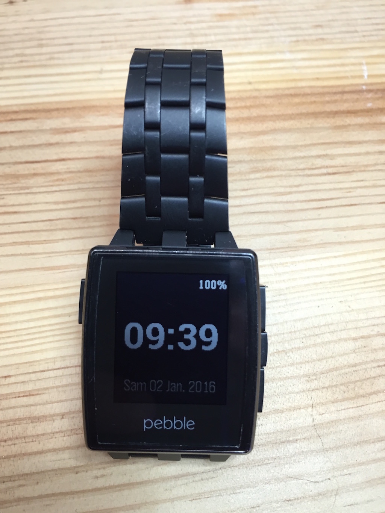
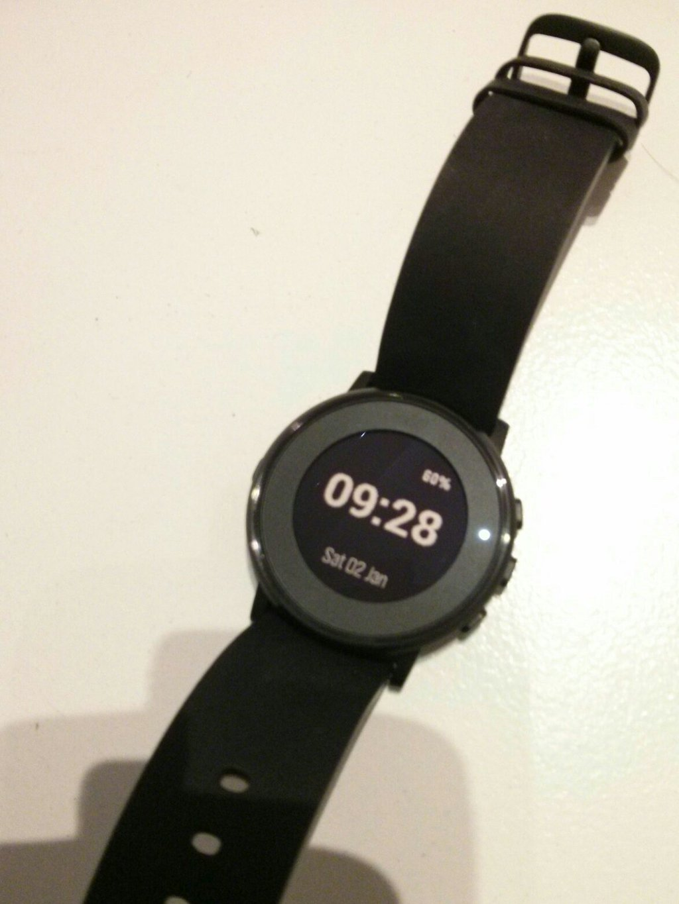

# YASWF
YASWF (Yet Another Simple WatchFace) is watchface displaying essential informations in a convenient manner : hour, date,
battery level, charging status, bluetooth disconnection.

This watchface supports official Pebble languages : English, French, Spanish and German (Chinese not tested).

## How does it look ?

On Pebble Steel

On Pebble Time Round (thanks to <a href="https://github.com/ndeverge">Nicolas Deverge</a> for the photo.)

